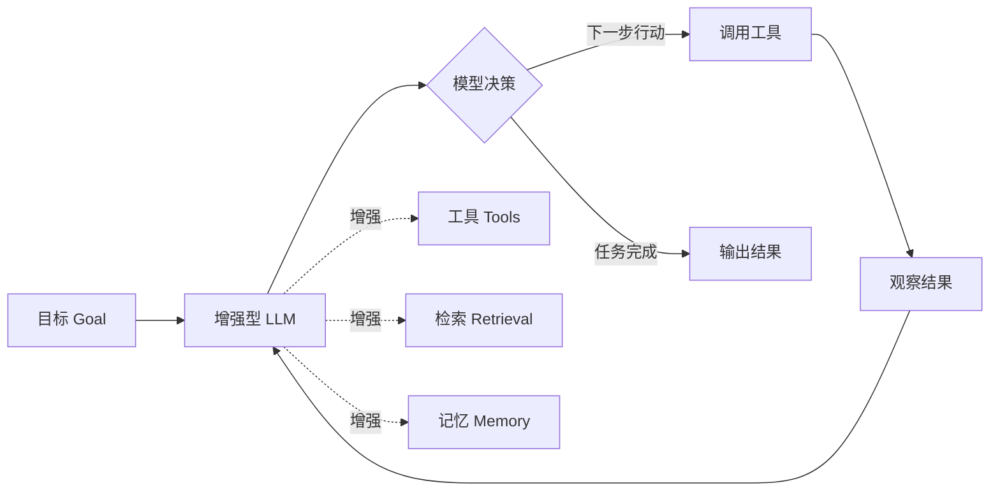

# Agent（智能体）学习笔记

## 学习目标

学完这一篇，你应该能回答：

1. Agent 和普通聊天机器人、和工作流（Workflow）到底差在哪？
2. 一个 Agent 系统内部由哪些部件组成、它是怎么"自己干活"的？
3. 什么时候该用 Agent，什么时候不该用？

## 一句话理解

我的理解：**Agent 是"把方向盘交给大模型"的程序系统**——你只给它一个目标（比如"把这个仓库的 bug 修了"），它自己在循环里决定下一步做什么：先读代码、再跑测试、发现问题、调用工具修改、再验证……每一步走哪条路是它现想的，不是人预先写死的。

我自己的类比：普通聊天机器人像"答录机"，你说一句它答一句；Agent 像"实习生"，你交代一个任务，他会自己排计划、查资料、动手做、遇到问题自己调整，做完才回来汇报。关键差别是**中间过程由谁决定**。

## 核心机制 / 组成

### 学术定义：先看 Anthropic 的划分

Anthropic 在《Building Effective Agents》（2024）里把所有"大模型+工具+多步执行"的系统统称 **agentic systems（智能体类系统）**，但内部画了一条关键界线：

- **Workflow（工作流）**：LLM 和工具沿着**预先用代码写死的路径**被编排。谁先谁后、走哪步，是定死的。菜谱式。
- **Agent（智能体）**：**LLM 自己动态指挥**流程和工具调用，自己决定怎么完成任务。大厨式。

判断标准就一句：**流程控制权在代码，还是在模型？**

### 一个 Agent 的组成

- **增强型 LLM（Augmented LLM）**：基础单元，就是"大模型 + 工具 + 检索 + 记忆"。
- **Agent 循环**：模型推理（想）→ 行动（调用工具）→ 观察结果 → 再推理，循环直到完成或触发停止条件。
- **工具**：让模型能"动手"的接口，比如执行代码、查网页、操作文件。学术源头是 **ReAct 模式**（2022 年论文）：把"推理"（Reasoning）和"行动"（Acting）交替进行，模型边说边做，靠观察修正推理。
- **记忆 / 上下文**：支撑模型跨步骤决策的信息（详见 llm-context.md 和 concept-relationship.md）。

## 具体应用场景

**场景一：AI 编程助手（如 Claude Code、Cursor）**。你告诉它"帮我给这个 Python 项目加一个单元测试框架"。它会自己：读项目结构 → 看现有代码 → 选测试框架 → 写配置文件 → 安装依赖 → 跑测试 → 失败就修 → 再跑。全程步骤是它自己规划的。

**场景二：自动化客服工单处理**。收到用户邮件后，Agent 自己判断：这属于退款类 → 查订单系统 → 核对政策 → 草拟回复并提交退款；信息不足 → 决定追问用户。每一步用的工具和判断都动态进行。

为什么用 Agent：任务**开放、路径不可预知**、需要多步工具操作。如果任务路径是固定的（比如"每天定时把 A 表数据复制到 B 表"），用固定脚本/工作流就够，别上 Agent。

## 容易混淆的概念辨析

| 概念 | 流程控制权 | 复杂度 | 我的区分口诀 |
|---|---|---|---|
| 聊天机器人 Chatbot | 无流程，一问一答 | 低 | 被动应答 |
| 工作流 Workflow | 在代码里（预定义） | 中 | 有轨电车，轨道铺好 |
| Agent 智能体 | 在模型里（动态决策） | 高 | 自动驾驶，现想现走 |
| 多智能体 Multi-Agent | 多个 Agent 分工协作 | 很高 | 一个团队 |

补充两个高频混淆点：

- **Agent ≠ RAG**。RAG（检索增强生成）只是"给模型临时喂资料"的一种增强手段，是 Agent 身上可选的一块零件（检索），不能划等号。
- **Agent ≠ 全自主**。很多 Agent 会主动停下来问人（Human-in-the-loop）。"自主程度"是一个光谱，全自动只是其中一个档位。

## 使用边界 / 常见误区

- **杀鸡用牛刀**。Anthropic 反复强调：先找最简单的方案，只有简单方案不够再往上加复杂度。很多任务单次 LLM 调用 + 检索就解决了，Agent 反而更慢更贵更难调。
- **成本与延迟**：Agent 每一步都要调模型，token 消耗和延迟是叠加的，出错率也随步骤累积。
- **不可预测 + 难调试**：路径是模型现想的，失败可能发生在任何一步，需要日志、沙箱、护栏（guardrail）。
- **不要一上来就上重型框架**。官方建议：先用 LLM API 直接写，能跑通再考虑框架；用框架也要理解底下发生了什么。
- 常见误区：以为 Agent = "万能自动机器人"，给个模糊目标就期待它完美完成一切——实际上目标越模糊、约束越少，Agent 越容易跑偏或空转。

## 自测问题

1. 判断：一个用 if-else 固定步骤调用大模型的程序，算 Agent 吗？

不算。它的流程控制权在代码里，属于 Workflow。判断标准是"谁决定下一步"。

2. 你老板说"我们要做一个 AI Agent 自动回客户邮件"，你第一件事该问什么？

问任务边界：回信的流程是固定的（查模板→填字段）还是开放的（需自己判断、多工具查询）？如果固定，先做 workflow 或规则，别急着上 Agent。

3. 简答：Agent 循环的基本四步是什么？

推理/规划（决定下一步）→ 行动（调用工具）→ 观察（读取结果）→ 循环，直到满足停止条件。

4. 为什么 Agent 比单次调用更容易累积错误？

每一步都可能出错，且错误会带着错误信息进入下一步的上下文，错误像滚雪球；步骤越多，端到端成功率越低，所以需要护栏和人工兜底。

## 参考来源

1. **Anthropic —《Building Effective Agents》（2024-12）**
   https://www.anthropic.com/engineering/building-effective-agents
   用途：支撑"Workflow vs Agent"划分、增强型 LLM、何时该用 Agent 等核心论断。官方一手来源。
2. **Yao et al. —《ReAct: Synergizing Reasoning and Acting in Language Models》（2022）**
   https://arxiv.org/abs/2210.03629
   用途：Agent 循环"推理-行动交替"的学术源头。可核查：arXiv 论文页，含摘要与原文。
3. **Anthropic — Agent Skills / Claude 平台文档（含"Agent 如何被扩展"的官方说明）**
   https://platform.claude.com/docs/en/agents-and-tools/agent-skills/overview
   用途：理解"Agent + 工具/技能"的现行生态。官方一手来源。

> 核查记录：上述 1、3 链接于 2026-09-07 通过搜索确认可访问；链接 2 为长期稳定学术资源。文中"有轨电车/实习生"类比为个人加工，非资料原文。
