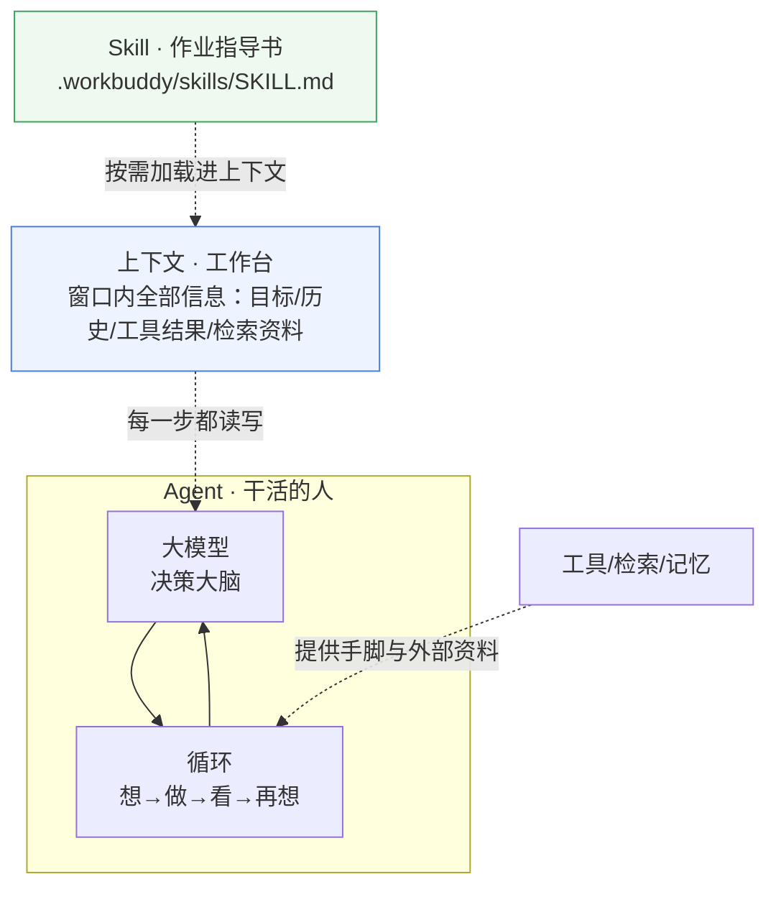

# 三概念关系：Agent × 上下文 × Skill

> 这是我自己理完三个概念后的关系梳理，不是资料搬运。阅读前建议先看 `agent.md`、`llm-context.md`、`skill.md` 三份单概念笔记。

## 一、一句话总览

**Agent 是"干活的人"，上下文是"他眼前的工作台"，Skill 是"他手边的作业指导书"。** 三者围绕同一条主线运转：让大模型在一个有边界的认知空间里，借助沉淀下来的方法，把开放性任务做对。

## 二、逐对关系

### 1. Agent 依赖上下文：工作台决定决策质量

Agent 的每一个"想下一步"的动作，都只基于**当前上下文窗口里有什么**。上下文里装的是：任务目标、对话历史、上一步工具调用返回的结果、检索到的资料。

关键推论（我的理解）：

- **上下文是 Agent 唯一的"现场记忆"**。Agent 没有窗口之外的记忆——它记得自己上一步做了什么，是因为上一步的输出被写回了上下文。忘了就等于没发生。
- **上下文里的信息质量 = 决策质量的下限**。工具返回了错数据，Agent 就会基于错数据规划下一步；历史太长把关键目标挤出窗口，Agent 就会"跑偏"。所以工程上真正要做的，是**让窗口里始终是当前任务最相关的信息**：做好检索、压缩、清理，并持续记录关键状态。
- **上下文管理是 Agent 工程的核心难题**：长任务中窗口会满，满了就要压缩/丢弃，丢了什么、怎么补，直接决定 Agent 会不会"失忆跑题"。Anthropic 专门把 context engineering 列为构建 agent 的关键话题，就是这个原因。

一句话：**上下文是 Agent 认知的边界，管好上下文，Agent 才靠谱。**

### 2. Skill 服务 Agent：把一次性经验变成可复用资产

没有 Skill 时，Agent 每次遇到同类任务都从零摸索，且**这次学会的做法下次就忘**（模型不会自动记住上次怎么做的）。Skill 打破了这个循环：

- Skill 把"某类任务该怎么做"固化成文件（SKILL.md 里的步骤、规则、模板、脚本），Agent 判断任务相关时**把 Skill 内容读进上下文**，照章执行。
- Skill 随 Git 版本管理、随仓库分发：一次写好，全团队/所有后续会话复用，还能持续迭代。
- 官方视角：Skill 让"通用智能体"获得"领域专长"——不是模型变聪明了，是模型学会了调用沉淀下来的方法。

一句话：**Skill 是 Agent 的程序性记忆（procedural memory），是团队经验的外部化存档。**

### 3. 上下文与 Skill 的接口：渐进式披露

两者不是割裂的，Skill 之所以能"装很多而不撑爆上下文"，靠的是上下文经济：

- 平时只有 Skill 的 `name + description`（约几十 token）常驻上下文；
- Agent 判断"要用这个技能"时，才把完整 SKILL.md（约数百 token）读入上下文；
- 更细的 references/scripts 在真正需要时才加载。

所以 **Skill 的设计本身就是一次"上下文管理"练习**：写什么进 description（常驻）、写什么进正文（触发才读）、什么拆到子文件（按需再读），层次越清楚，对上下文的消耗越可控。

## 三、关系总表

| 维度 | Agent | 上下文 Context | Skill |
|---|---|---|---|
| 角色 | 执行者：动态决策与行动 | 舞台：模型决策所依据的全部现场信息 | 资产：可复用的任务方法论 |
| 回答的问题 | 下一步做什么 | 我看到什么、依据什么决策 | 这类活该怎么干 |
| 变动频率 | 每次任务按需构建 | 每一步都在变（读入/写入/截断） | 低频演进（随实践维护） |
| 与另两者的关系 | 是主体 | Agent 的认知边界、Skill 的加载介质 | 被 Agent 按需加载进上下文 |
| 失控风险 | 跑偏/空转 | 关键信息被挤掉导致失忆 | 描述差导致误触发/漏触发 |

## 四、三个概念串成一个完整故事（个人理解）

> 用老师作业本身当例子：我要在 WorkBuddy 里学三个新概念。
> 1. 我写了一个 concept-learner **Skill**，把"如何生成合格学习资料"的方法沉淀进 `.workbuddy/skills/`（可提交 Git、可复用去学别的概念）。
> 2. 我作为用户发出任务，AI（Agent 式工作）把任务目标、Skill 的内容、我仓库的现状全部读进**上下文**。
> 3. Agent 在上下文这个工作台上一遍遍规划、产出、自检、落盘，直到三份资料 + 关系说明写完。
> 4. 下次我要学"RAG"，不用重写流程——**Skill 还在仓库里，重新触发即可**。上下文每轮是临时的，Skill 是持久的。

这正好说明了三者的分工：**上下文给 Agent 每一次决策的"此刻"，Skill 给 Agent 跨越时间的"传承"。**

## 五、自测

1. 为什么 Agent 长任务容易"跑偏"？用上下文解释。

任务早期确定的约束/中间结果存在上下文里，随着步骤增多、内容变长，关键约束可能被压缩或挤出窗口，Agent 后续决策依据丢失，就会偏离原目标。

2. Skill 为什么能让 AI"学会"重复任务？

Skill 把方法固化成文件并随 Git 留存，每次任务需要时重新加载进上下文。模型自身不记忆，但 Skill 文件"替它记住"，实现跨会话复用。

3. 判断：Skill 内容一旦写错，AI 会一直用错的方法，对吗？如何避免？

对，Skill 会稳定复现错误方法。避免要靠维护：使用中发现问题就修订 SKILL.md 并提交新版本，让错误不扩散。

