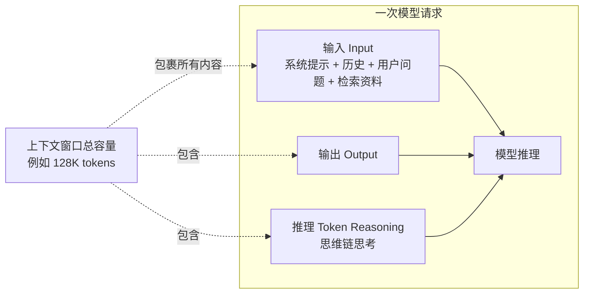

# 大模型的上下文（Context）学习笔记

## 学习目标

学完这一篇，你应该能回答：

1. "上下文"到底指什么？上下文窗口（Context Window）又是什么？
2. 为什么说"模型一次能看到的全部信息"决定了它会怎么回答？
3. 上下文和 Agent、和模型的"记忆"是什么关系？

## 一句话理解

我的理解：**上下文 = 模型在生成当前这一句话时，眼前能看到的全部内容**。它由系统提示词、用户的问题、对话历史、临时塞进去的资料（比如 RAG 检索结果）拼成，全都以 token 形式放进一个有限大小的"窗口"（上下文窗口）里。模型不记得窗口之外的任何东西——窗口就是它的全部"现场记忆"。

我自己的类比：上下文窗口像一张**有边界的白板**。模型只能看着白板上现有的字来写下一笔。白板写满了，要么擦掉旧内容（截断/遗忘），要么换更大的白板（更大的窗口）。模型脑子里"学过的东西"（训练知识）是另一回事，相当于它上过学积累的常识——这两样别混。

## 核心机制 / 组成

### Token：上下文的基本单位

模型读写文本不是按"字"，是按 **token（词元）**。一个 token 大约相当于 0.75 个英文单词或更少的汉字片段。一段文字切成的 token 数决定了它占多少"窗口空间"，也直接决定 API 费用（按 token 计费）。

### 上下文窗口：一次请求的容量上限

- **上下文窗口 = 一次请求中 输入 + 输出 + 推理 token 的总上限**（不同模型不同，从几千到上百万 token 都有）。
- 输入超限 → 报错或截断；对话越长，历史占的窗口越多。
- 输出上限单独限制（比如一次最多生成多少 token）。
- 长上下文还有"**中间迷失**（lost in the middle）"现象：模型对开头和结尾的内容利用率高，对埋在中间的细节容易忽略——窗口大 ≠ 全都用得好。

### 多轮对话为什么"记住"前面的话

聊天应用把**整个对话历史**重新塞进每次请求的输入里，所以看起来"记住了"。一旦超过窗口被截断/压缩，早期内容就消失了。它记住你，是因为你每次都把历史喂给它，而不是它自己会回忆。

## 具体应用场景

**场景一：Few-shot 示例**。你想让模型按特定格式输出，就在输入里塞 2-3 个"输入→正确输出"的例子。例子占的就是上下文空间。

**场景二：RAG 知识库问答**。用户问公司政策，系统先把相关文档片段检索出来，拼进上下文，再让模型回答。文档片段就是上下文里的临时资料。

**场景三：长文档/代码库分析**。把整份合同或整个项目的关键文件放进去让模型总结/找问题。放得下放不下、放进去能不能用好，都取决于窗口大小和内容组织。

## 容易混淆的概念辨析

| 概念 | 是什么 | 我的区分口诀 |
|---|---|---|
| 上下文 Context | 本次请求喂给模型的全部内容 | 眼前的白板 |
| 上下文窗口 Context Window | 一次请求能容纳的最大 token 数 | 白板的尺寸 |
| 训练知识/参数记忆 | 模型在训练时学进参数里的知识 | 上过的学 |
| 长期记忆产品 | 把历史存到外部，下次再取回放进上下文 | 外部笔记本 |
| 输出上限 Max Output | 一次最多能生成多少 token | 一次写多长 |

高频混淆点：

- **上下文 ≠ 模型的记忆**。模型"懂 Python"来自训练；它"知道你刚才说了什么"来自上下文。两者来源完全不同（一个在参数里，一个在输入里）。
- **上下文窗口大小 ≠ 有效利用长度**。窗口 1M 的模型，不表示塞 800K 就一定效果好——中间迷失、检索不到关键片段都会拉低效果。

## 使用边界 / 常见误区

- **窗口溢出**：对话/资料太长放不下 → 报错（API）或内容被截断。解决：精简、删历史、摘要压缩、分块。
- **被截断后无痕**：一旦早期内容被挤出窗口，模型对它彻底"失忆"，且**不会主动察觉**自己忘了。
- **成本与速度**：输入 token 越多，费用越高、响应越慢。每次请求都全量带历史，是对话类应用的主要开销来源。
- **上下文里放错信息 = 误导模型**：RAG 检索到错误文档，模型会一本正经地基于错资料回答（幻觉的常见来源之一）。上下文内容要过一道质量关。
- 常见误区：以为"给模型发一大段资料它就能永远记住"，其实只在窗口内有；以为上下文越大越省事，其实组织好内容比堆大窗口更关键。

## 自测问题

1. 判断：模型的上下文窗口有 128K，我把一份 200K token 的文档发给它，它也能处理。对吗？

不对。超过窗口上限会报错或截断。要么换更大窗口模型，要么先对文档做切分/摘要。

2. 为什么聊天机器人聊久了会"忘掉"开头的话？根本原因是什么？

因为每次请求要带上全部历史，历史太长超出窗口就会被截断/压缩。根本原因是上下文窗口容量有限，模型自身没有独立于输入的"回忆"机制。

3. 简答：一次 API 调用中，哪些东西会占用上下文窗口？

输入 token（系统提示、历史、用户输入、检索资料）、输出 token、以及部分模型的推理 token（思维链）。

4. 场景题：RAG 系统检索出了一段与问题无关的资料，可能发生什么？

模型可能被这段错误上下文带偏，给出看似合理但基于错误资料的答案。需要检索质量控制和"引用来源可核验"的设计。

## 参考来源

1. **OpenAI —《Conversation state》（官方 API 文档，含上下文窗口管理说明）**
   https://platform.openai.com/docs/guides/conversation-state
   用途：支撑"上下文窗口 = 输入+输出+推理 token 上限""超限截断"等论断。官方一手来源。
2. **OpenAI —《Advanced usage》（token 机制与计费说明）**
   https://developers.openai.com/api/docs/guides/advanced-usage/
   用途：支撑 token 化、每 token 计费、输入输出共同占上限等论断。官方一手来源。
3. **OpenAI —《Compare models》（各模型上下文窗口参数对照）**
   https://platform.openai.com/docs/models/compare
   用途：查具体模型的上下文窗口数字。官方一手来源。
4. **Anthropic —《Building Effective Agents》中"增强型 LLM / 记忆与上下文管理"相关章节**
   https://www.anthropic.com/engineering/building-effective-agents
   用途：理解上下文/记忆在 Agent 系统中的角色（与 agent.md、concept-relationship.md 呼应）。

> 核查记录：链接 1、2、3 于 2026-09-07 通过搜索确认可访问（链接 2 与 1 互为镜像域）。"白板/上学"类比为个人加工。注意：模型与上下文窗口的具体数值随版本更新，引用时以官方 Models 页当前数据为准。
