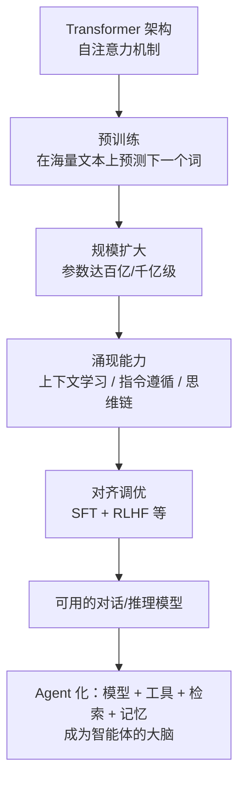

# 大语言模型（LLM）学习笔记

## 学习目标

学完这一篇，你应该能回答：

1. 大语言模型（LLM）到底是什么？它和传统机器学习模型差在哪？
2. LLM 是怎么被"造"出来的？为什么规模变大后会冒出小模型没有的能力？
3. 在 Agent 系统里，模型扮演什么角色？它和上下文、Skill 是什么分工？

## 一句话理解

我的理解：**LLM 是"读了海量文字、靠'预测下一个词'练出来的巨型神经网络"**——它把人类写过的书、网页、代码都读进参数里，学会的不是背答案，而是"接着写下去"的语言规律，于是给它一句话，它能续写、能问答、能推理、能写代码。

我自己的类比：LLM 像一个"只读过书、从没上过班"的文字天才。它没长手没长脚（不会自己行动），只能输出文字；但你给它一个任务描述（提示词），它能像最聪明的实习生一样把该说的都想明白、说清楚。**要它真正"动手干活"，就得给它配上工具和身体——这就是 Agent 出现的原因**。

## 核心机制 / 组成

### 三个关键支柱：架构、预训练、规模

1. **架构：Transformer + 自注意力**。2017 年《Attention Is All You Need》提出 Transformer，用"注意力"机制让模型处理长文本时能看到词与词之间的关系。今天的主流 LLM（GPT、Claude、Llama、DeepSeek 等）都用这个架构。
2. **预训练：预测下一个词**。把互联网级别的文本喂给模型，让它反复练习"根据前文预测下一个词"。练完，语言规律、事实知识、推理模式都沉淀进模型的参数里。注意：这个阶段模型只会"续写"，不会"对话"。
3. **规模 → 涌现能力**。当参数规模跨过某个门槛（百亿级往上），模型会冒出小模型没有的能力（综述里称为 emergent abilities，涌现能力）：**上下文学习**（给几个例子它就会照着做）、**指令遵循**（听懂人话指令）、**思维链推理**（一步步想）。GPT-3 之后的路线基本靠"更大"换"更会"。
4. **对齐：让它听话**。用指令微调（SFT）和人类反馈强化学习（RLHF）等方法，把"会续写的机器"调教成"愿意好好回答的助手"，并学会拒绝危险请求。

### LLM 在 Agent 系统里的位置

Agent 的循环是"想→做→看→再想"，其中**"想"就是模型干的**：模型读上下文里的目标与工具结果，输出"下一步该调用哪个工具、参数是什么"，Agent 框架负责执行。模型本身只有文字进文字出，工具、检索、记忆这些"增强"围在它周围（Anthropic 称为 augmented LLM，增强型 LLM）。

## 具体应用场景

**场景一：对话/创作助手**。ChatGPT、文心一言这类产品，本质是"LLM + 聊天外壳"。你输入问题，模型在上下文里看到你的话，续写出回答。

**场景二：Agent 的决策大脑（本项目同款用法）**。llm-wiki-agent 这种项目里，Claude/Codex/Gemini 各自背后的 LLM 负责"读懂一篇论文 → 决定怎么写 wiki 页面 → 调工具建图"的全部智力工作。模型是大脑，文件系统是身体，AGENTS.md 是操作规程。

**场景三：代码生成与补全**。给模型"函数签名 + 注释"，它生成实现；给一段 bug 代码，它定位问题。Cursor、Copilot 都是 LLM 在背后。

## 容易混淆的概念辨析

| 概念 | 本质 | 我的区分口诀 |
|---|---|---|
| 机器学习模型（传统） | 针对单一任务训练的小模型（分类、回归） | 只会一门手艺的技工 |
| 大语言模型 LLM | 预训练+规模化，多任务通用的文字大脑 | 读了万卷书的通才 |
| ChatGPT 等产品 | LLM + 产品外壳（对话界面、安全、记忆功能） | LLM 的"营业门店" |
| Agent（智能体） | LLM + 工具 + 循环 + 记忆组成的行为系统 | LLM 装上了手脚 |
| 模型微调（Fine-tune） | 在通用 LLM 基础上用领域数据再训练 | 通才再上职业培训班 |

高频混淆点：

- **LLM ≠ 聊天机器人**。ChatGPT 是产品，它背后是 LLM 加一层产品化包装；很多聊天机器人只是 LLM 的一种用法。
- **LLM ≠ Agent**。模型是"只会输出的文字大脑"，Agent 是"能调用工具、能行动的系统"。把模型装进 Agent 框架，模型才有手有脚。
- **"模型"这个词在不同语境不同义**：在"训练模型"里指算法参数本身；在"调用模型 API"里指一个部署好的推理服务。作业语境中"模型"通常指 LLM。

## 使用边界 / 常见误区

- **知识有截止日期**：LLM 学的是训练时的语料，不知道之后发生的事（除非外部检索补充）。
- **幻觉**：模型会一本正经地编造看似合理的内容，尤其被问到知识盲区时。需要"可核查来源"的设计来兜底（你在资料里每条来源都要求可核查，就是这个原因）。
- **上下文窗口有限**：模型一次只能"看到"窗口内的内容（见 llm-context.md），超出就忘。
- **大模型对小任务杀鸡用牛刀**：分类、抽取这类固定任务，小模型或规则更快更便宜。Anthropic 的建议：能用简单方案就别上大模型。
- 常见误区：以为 LLM"什么都知道、不会错"。它擅长的是"流畅地像知道"，事实准确性要靠资料、检索和人工核查保证。

## 自测问题

1. 判断：LLM 预训练阶段就在学"怎么跟人对话"。对吗？

不对。预训练阶段只学"预测下一个词"（续写）。"会对话"来自之后的指令微调和人类反馈对齐。

2. 为什么参数规模变大后会出现"涌现能力"？举两个例子。

当规模跨过阈值，小模型没有的能力突然出现，例如：上下文学习（给几个示例就能照做）、指令遵循、思维链推理。学界对涌现的机制仍有争论，但经验规律是规模带来质变。

3. 简答：Agent 系统里，模型、上下文、Skill 各干什么？

模型是决策大脑（负责"想"）；上下文是模型每次决策能看到的全部信息（工作台）；Skill 是按需加载进上下文的方法包（作业指导书）。模型本身不能行动，靠 Agent 循环里的工具行动。

4. 场景题：老板让"用大模型自动提取合同里的金额"，你直接调最大的模型 API。有何不妥？

任务固定、边界清晰，可能用不上最大最贵的模型；先评估小模型/规则/提示方案，简单方案能解决就别上大模型（成本、延迟、幻觉风险都更低）。

## 参考来源

1. **Wayne Xin Zhao 等 —《A Survey of Large Language Models》（2023，持续更新）**
   https://arxiv.org/abs/2303.18223
   用途：支撑 LLM 定义、涌现能力（上下文学习/指令遵循/思维链）、预训练-调优-利用-评估四方面框架。权威综述，2026-09-09 检索确认存在。
2. **Vaswani 等 —《Attention Is All You Need》（2017）**
   https://arxiv.org/abs/1706.03762
   用途：支撑"Transformer + 自注意力是现代 LLM 架构基础"论断。长期稳定学术资源。
3. **OpenAI —《Compare models》（官方模型文档）**
   https://platform.openai.com/docs/models/compare
   用途：查具体模型参数、上下文窗口、能力差异（本仓库 llm-context.md 同源引用）。
4. **Anthropic —《Building Effective Agents》（2024）**
   https://www.anthropic.com/engineering/building-effective-agents
   用途：支撑"增强型 LLM = 模型 + 工具 + 检索 + 记忆"以及"模型在 Agent 中承担动态决策"论断（与 agent.md 呼应）。
5. **中文维基百科 —《大型语言模型》**
   https://zh.wikipedia.org/wiki/大型语言模型
   用途：中文入门背景对照。

> 核查记录：链接 1、4 于 2026-09-09 经检索确认有效；链接 2、3 为长期稳定学术/官方资源；链接 5 本机网络当日访问受限，已由作者另行复核。个人类比（"文字天才/通才技工"）为个人加工，非资料原文。本文档已经作者通读核查（2026-09-09）。
