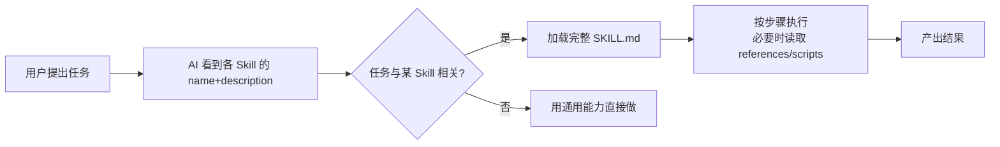

# Skill（Agent Skill）学习笔记

## 学习目标

学完这一篇，你应该能回答：

1. Skill 到底是什么？它解决了模型的什么问题？
2. SKILL.md 长什么样？Skill 存放在哪里、怎么被 AI 发现和调用？
3. Skill 和普通提示词（Prompt）、和 MCP/插件有什么不同？

## 一句话理解

我的理解：**Skill 是把"做某一类任务的方法"打包成文件、放在规定目录里、让 AI 按需读取执行的说明书包**。它把"专家脑子里的做法"（步骤、规则、模板、脚本）变成 AI 能读的文本和文件，AI 觉得任务相关时就加载它照着做。做完这次，下次同类任务还能复用——知识沉淀下来了。

我自己的类比：Skill 像给新员工看的**岗位 SOP 手册**。公司没有手册时，每个新人（每次对话的 AI）都得从头摸索，做出来的东西五花八门；有了手册，新人按手册办事，质量稳定、还能把老师傅的经验传下去。本仓库里这个 concept-learner 就是一份"如何生成概念学习资料"的 SOP。

## 核心机制 / 组成

### SKILL.md：一个 Skill 的最小单位

```text
concept-learner/            # 目录名 = 技能名（全小写+连字符）
└── SKILL.md                # 必须存在：YAML 元数据 + Markdown 正文
```

SKILL.md 结构：

```yaml
---
name: concept-learner        # 技能名，与目录名一致
description: 概念学习资料生成器。当用户想学习某个新概念并要求生成结构化学习资料时使用…
---
# 正文：告诉 AI 怎么做
## 适用场景 … ## 输入信息 … ## 生成步骤 … ## 输出结构 …
```

- **name / description** 是必填元数据。AI 靠 description 判断"这个技能该不该现在用"。
- **渐进式披露（progressive disclosure）**：平时只把 name+description 给模型看（约几十 token，不占多少上下文）；模型判断相关后才读取完整 SKILL.md；更细的资料可放 `references/`、脚本放 `scripts/`、模板放 `assets/`，按需再加载。这样 AI 可以同时装几十上百个 Skill 而不撑爆上下文窗口。
- **推荐把主文件控制在 500 行内**，细节拆到子文件。

### Skill 存在哪里（两级）

| 级别 | 路径 | 作用范围 |
|---|---|---|
| 用户级（个人） | `~/.workbuddy/skills/`（WorkBuddy）/ `~/.claude/skills/`（Claude） | 我所有项目都能用 |
| 项目级（随仓库走） | 仓库根目录 `.workbuddy/skills/` 或 `.claude/skills/` | 只有打开这个项目/仓库时可用；**随 Git 提交，团队共享** |

本作业的 concept-learner 属于**项目级**：它放在仓库根目录 `.workbuddy/skills/` 下，提交到 GitHub 后，任何人 clone 这个仓库并在 WorkBuddy 中打开，都能调用它。这正是"Skill 随代码走、可版本管理、可分发"的价值。

### 工作流程



## 具体应用场景

**场景一（本仓库）**：老师在课程里让"学习 Agent / 上下文 / Skill 三个概念"。我把"如何产出一份合格概念学习资料"的方法固化成了 concept-learner 这个 Skill，然后直接让它按流程生成三份笔记——同一份方法论以后学"RAG""MCP"等任何新概念还能复用。

**场景二：专业文档处理**。Anthropic 官方预置的 PPTX/XLSX/DOCX/PDF 等 Skill：AI 要生成 PowerPoint 时自动加载对应技能，知道该用什么库、什么结构，而不是每次瞎试。

**场景三：团队规范固化**。比如把"公司 PPT 必须用哪些字体、什么配色"写成一个 brand-guidelines Skill 放进仓库，全团队 AI 生成的对外材料自动合规。

## 容易混淆的概念辨析

| 概念 | 本质 | 我的区分口诀 |
|---|---|---|
| Prompt（提示词） | 一次性文本指令 | 口头交代一次 |
| Skill | 结构化、可版本管理、可随仓库分发的说明书包 | 存档的 SOP 手册 |
| MCP / Tool | 给 AI 接外部工具/数据的**连接标准** | AI 的"手" |
| Skill | 教 AI"这类活怎么干"的**知识包** | AI 的"方法" |
| Subagent（子智能体） | 独立上下文、独立任务的 AI 分身 | 派出去的员工 |

高频混淆点：

- **Skill ≠ 更长的 Prompt**。Prompt 是一次性对话文本；Skill 是文件系统里带元数据、可被自动发现、按需加载、可被 Git 管理复用的标准结构。Anthropic 官方把 Skill 定位为"将程序性知识（procedural knowledge）打包"的机制。
- **Skill ≠ MCP**。MCP 解决"AI 怎么连上工具/数据源"（连接层）；Skill 解决"AI 怎么把活干对"（知识层）。两者互补：可以给 Skill 配脚本，也可以让 Skill 教 AI 去用某个 MCP 工具。
- **Skill ≠ 每次都会自动生效**。AI 要"判断相关才加载"，description 写得含糊就可能导致该用时不用、不该用时乱用。

## 使用边界 / 常见误区

- **描述决定触发**：description 要写清"做什么 + 什么时候用"，这是 AI 决定是否调用它的唯一依据。
- **内容质量决定上限**：Skill 只是把方法固化，方法本身错、过时，AI 照做也是错的。要定期维护更新。
- **安全风险**：Skill 本质是"让 AI 按外部指令行事"，恶意 Skill 可能诱导 AI 执行危险操作（读敏感文件、外传数据、乱跑命令）。只用可信来源的 Skill，安装前要审计 SKILL.md 和附带脚本。官方对此有明确安全警告。
- **别写成一次性提示词**：好的 Skill 要抽象出可复用的流程（能接收不同输入），只针对单一任务的 Skill 价值有限。
- 常见误区：把 Skill 当"万能指令库"，指望它替 AI 变聪明——Skill 沉淀的是流程和知识，不改变模型本身能力。

## 自测问题

<details>
<summary>1. 判断：把一个长提示词保存成 .txt 文件放在桌面，就是 Skill 了。对吗？</summary>

不对。Skill 必须按标准结构组织：目录名=技能名，内含带 YAML 元数据（name/description）的 SKILL.md，且放在 AI 会发现的目录（如项目 .workbuddy/skills/、用户 ~/.workbuddy/skills/）。裸 txt 不会被发现和加载。
</details>

<details>
<summary>2. 为什么"渐进式披露"让 AI 能同时装很多 Skill？</summary>

因为平时只暴露几十 token 的 name+description 元数据给模型，完整内容在触发时才加载。几十个 Skill 只占极小上下文，模型不会眼花缭乱。
</details>

<details>
<summary>3. 简答：项目级 Skill 和用户级 Skill 的差别？</summary>

项目级放仓库根目录 .workbuddy/skills/，随 Git 提交、随仓库分发、只有打开该项目时可用，适合团队共享；用户级放用户主目录 ~/.workbuddy/skills/，对该用户所有项目可用，是个人私藏。
</details>

<details>
<summary>4. 场景题：你想让 AI 每次写论文摘要都按某大学格式来，该怎么做最合理？</summary>

把这所大学的摘要格式规范写成 Skill（说明适用场景、输入论文、输出格式步骤、自检要求），放在项目级 .workbuddy/skills/ 并提交 Git，需要时触发；比每次复制粘贴一段提示词可靠、可复用、可维护。
</details>

<details>
<summary>5. 为什么官方警告"不要用不可信来源的 Skill"？</summary>

Skill 内容会指导 AI 行动（读文件、跑脚本、调工具）。恶意 Skill 可注入指令让 AI 泄露数据、执行危险操作。装 Skill 像装软件，先审计再信任。
</details>

## 参考来源

1. **Claude/Anthropic —《Creating custom skills》（官方技能制作指南）**
   https://claude.com/docs/skills/how-to
   用途：支撑 SKILL.md 结构（YAML 元数据、目录结构、500 行建议、测试方法）。官方一手来源。
2. **Claude Platform —《Agent Skills 概述》（官方平台文档）**
   https://platform.claude.com/docs/en/agents-and-tools/agent-skills/overview
   用途：支撑 Skill 定义、name/description 字段规范、渐进式披露、安全警告。官方一手来源。
3. **WorkBuddy/CodeBuddy 官方文档**
   https://www.codebuddy.cn/docs/workbuddy/Overview
   用途：支撑本仓库所用 WorkBuddy 的 Skill 两级存放机制（用户级 `~/.workbuddy/skills/`、项目级 `.workbuddy/skills/`）。
4. **Anthropic 博客 —《Building Agents with Skills》（2025，阐述 Skill 解决"智能体缺乏领域专长"问题）**
   https://claude.com/blog/building-agents-with-skills-equipping-agents-for-specialized-work
   用途：支撑"Skill 把通才 AI 变成专才、弥补其不会自动学习重复任务"的核心论点。

> 核查记录：链接 1、2、4 于 2026-09-07 通过搜索确认可访问；链接 3 为产品官方文档域名。类比与"两级存放"表格为个人整理。Skill 生态迭代很快，字段与路径以官方当前文档为准。
