> 本文档由 `kaoyan-feedback-polish` skill 从原始 docx 优化而来。
> 标注约定：`<mark title='易错'>` = 易错点，`<mark title='次重点'>` = 次重点，`<mark title='框架'>` = 框架性内容，`**加粗**` = 原文档下划线（需背诵）。
> 以 `> ` 开头的引用块 = AI 补充内容；`✎` 行为拼写/释义订正提示。

# 每日学习反馈
2026.09.10 · 知栀
本文档保留你的全部原始笔记与标红/划线/高亮重点；AI 补充内容以「楷体·深蓝」单独分块，与笔记互不混淆。

## 一、政治：马原
你原有的划线、高亮与蓝色批注全部保留。

### 1. 意识与物质
意识是人脑的机能和属性，是客观世界的主观映象。物质对意识的决定作用表现在意识的起源和本质上。
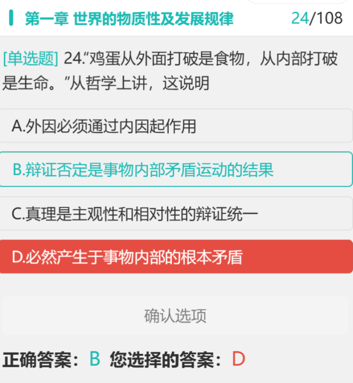
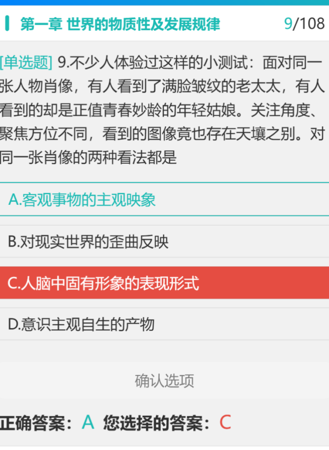

### 2. 辩证否定观
<mark title='易错'>否定是事物的自我否定、自我发展，是事物内部矛盾运动的结果。</mark>
辩证否定是事物的自我否定，不是相互否定，也不是一物否定另一物（比如人踩死一只虫子，是对虫子的否定，但这是外部否定，不是事物的自我否定。
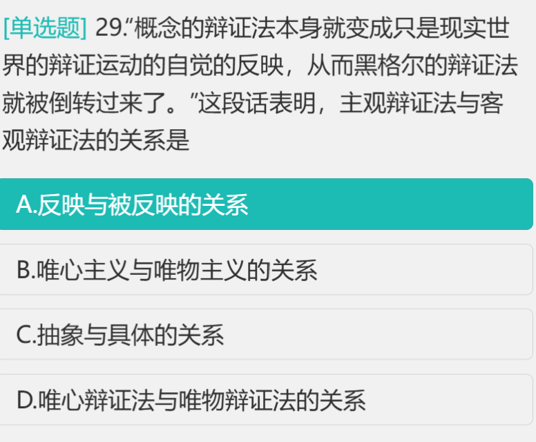
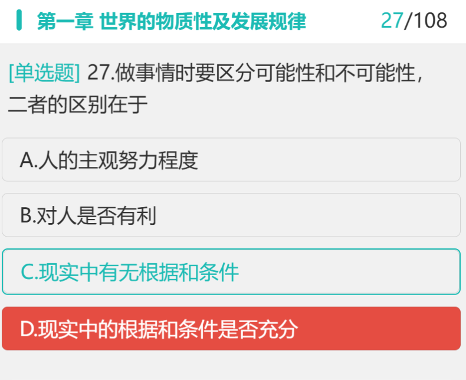

### 3. 可能性的两种形式
可能有两种形式，即现实的可能和抽象（非现实）的可能，二者的区别在于，现实中的根据和条件是否充分。而可能性和不可能性的区别在于，现实中有无根据和条件。这里要注意区别抽象的可能与不可能。
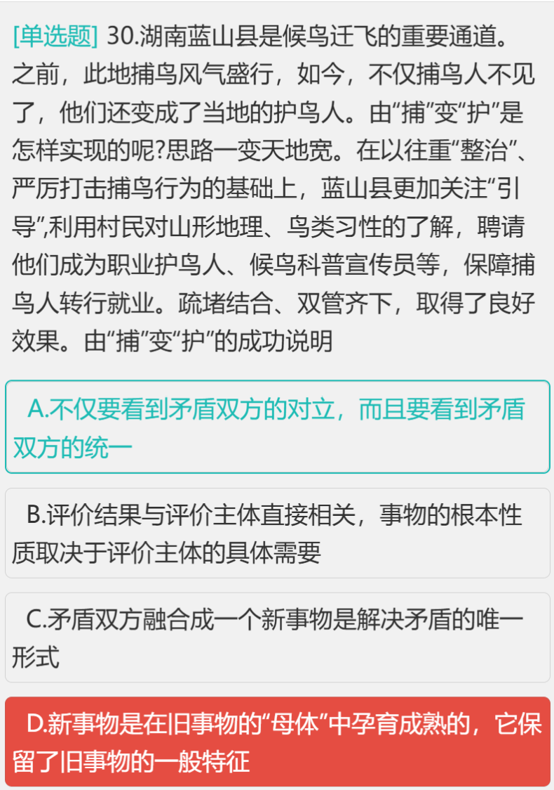

### 4. 客观辩证法与主观辩证法
<mark title='易错'>主观辩证法是客观辩证法在人的思维中的反映。客观辩证法与主观辩证法在本质上是统一的，但在表现形式上是不同的。客观辩证法采取外部必然性形式，不以人的意志为转移，是物质世界本身的联系和发展。主观辩证法则采取观念的、逻辑的形式，是同人类思维的自觉活动相联系的，是以概念为基础的辩证思维规律，是辩证法的科学体系。因此，可以简要地把主观辩证法称为概念辩证法。</mark>
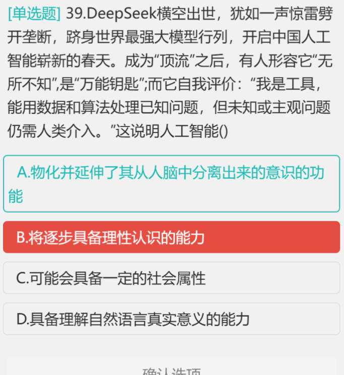

### 5. 错题要点（含你标注的其余内容）
新事物是在旧事物的「母体」中孕育成熟的，它既否定了旧事物中消极腐朽的东西，又保留了旧事物中合理的、适应新条件的因素，并添加了旧事物所不能容纳的新内容。D 错误。
人工智能对人类的理性智能的模拟和扩展，不具备认识能力。
诸多的「风险挑战」和「机遇」是不确定的趋势即偶然性，因此我们要善于从偶然中发现必然，把握有利于事物发展的机遇。D 与选项无关。
项 B，内容是构成事物的一切要素的总和，而形式是把诸要素统一起来的结构或表现内容的方式，并不能说害怕狐狸是害怕老虎的形式，因为「害怕狐狸」本身就是一个假命题，它是一种假象，而不是某种形式。故不选。选项 D
✎ 「项 B」前缺字 → 原文作「项B」，疑漏「选」字
注：以上 5 条在你原文中与「客观辩证法」同一段，此处按知识点拆分，文字未作改动。

## 二、政治：史纲

### 你的待整理清单（原文保留）
建立一个表格分清秋收起义、瓦窑堡会议、遵义起义这三个的不同地位和意义
✎ 遵义起义 → 遵义会议（遵义会议是会议，不是起义）
2、中共七大在党的历史上具有重要的里程碑意义，标志着党在政治上、思想上、组织上的成熟
3、抗日战争的胜利是中华民族从近代以来陷入深重危机走向伟大复兴的历史转折点。
4、整理整风运动的意义和背景（简要）
5、毛泽东的著作常考的几个，简单说内容
✎ 原文第 5 条 → 起首缺序号「5、」，此处按顺序补出
6、古田会议确立了思想建军、政治建军原则，是党和人民军队建设史上的重要里程碑。
7、秋收起义打出来了工农革命军的旗帜，不仅是军队的调动，更是数量众多的工农武装参与
8、八七会议确定了土地革命和武装起义。
✎ 八七会议确定了土地革命 → 通行表述为「确定了土地革命和武装反抗国民党反动派的总方针」

### AI · 你要的三会议对比表（第 1 条）
> 八七会议（1927.8.7，汉口）：纠正陈独秀右倾错误，确定土地革命和武装反抗国民党反动派的总方针，毛泽东提出「政权是由枪杆子中取得的」。地位：由大革命失败到土地革命战争兴起的历史性转折。
> 秋收起义（1927.9）：首次公开打出「工农革命军」旗帜，受挫后转向井冈山，开辟了农村包围城市、武装夺取政权的道路。
> 遵义会议（1935.1）：集中解决军事问题和组织问题，确立毛泽东在党中央和红军的领导地位。地位：党的历史上生死攸关的转折点，标志党从幼年走向成熟。
> 瓦窑堡会议（1935.12）：确立建立抗日民族统一战线的策略方针，批判「左」倾关门主义。地位：政治路线上的转折。
> 记忆抓手：八七定方向 → 秋收开道路 → 遵义定领导 → 瓦窑堡定策略。四个「转折」不要混：八七是「大革命→土地革命」，遵义是「生死攸关」，瓦窑堡是「政治路线」。

### AI · 第 4 条：整风运动的意义与背景
> 背景：抗战进入相持阶段，党内长期存在的主观主义、宗派主义、党八股尚未肃清；王明「左」倾教条主义的影响仍在，需要统一全党思想。
> 时间：1941 年从党内部开始，1943 年结束（结束后共产国际解散）。
> 内容：反对主观主义以整顿学风、反对宗派主义以整顿党风、反对党八股以整顿文风。其中反对主观主义是中心任务。
> 方针：「惩前毖后、治病救人」。
> 意义：全党确立了实事求是的思想路线，为抗战胜利和新民主主义革命胜利奠定思想基础。

### AI · 第 5 条：毛泽东常考著作速记
> 《中国社会各阶级的分析》（1925）：分清敌友是革命的首要问题。
> 《中国的红色政权为什么能够存在？》《井冈山的斗争》（1928）：「工农武装割据」思想。
> 《星星之火，可以燎原》（1930）：农村包围城市、武装夺取政权道路。
> 《〈共产党人〉发刊词》（1939）：总结出统一战线、武装斗争、党的建设三大法宝。
> 《新民主主义论》（1940）：新民主主义革命总路线，政治/经济/文化三大纲领。
> 《论持久战》（1938）：批驳速胜论和亡国论，提出三阶段。
> 记忆法：按时间轴串起来，比单独背单篇更有效。

## 三、专业课：新闻学第 14 讲 · 新闻法治与新闻学科

### 你的笔记 · 新闻法治的定义
**新闻法治：答：新闻法治是指在新闻传播领域，依照法律规范建立的管理方法、运行机制和体制，用来培养法律至上、限制权力，保障权力的原则。（价值取向，治理原则和道德追求）推进法治理念可以为新闻自由提供保障，……（属于我们国家民主建设的范畴，新闻法治保障公民的知情权、表达权、参与权，监督权）相较于「人治」而言，法治中「法」是主格，体现了法治理念和法律平等的观念（强调人民主权和法治治理）**
✎ 保障权力 → 保障权利（下文你自己已写「保障公民的知情权」，可见此处为笔误）

### 你的笔记 · 按「定义、保障、与法制的区别」记忆
<mark title='易错'>按照：定义、保障、与法制的区别来记忆。参考答案：定义：新闻法治是指在新闻传播领域，建立起依照法律规范的治理方式、制度以及运行机制，培养起法律至上、限制权力、保障权利的价值取向、治理原则和政治追求。新闻法治涵盖了管理、服务、职务三组关系。</mark>
**保障：新闻立法是新闻法治的首要保障，以法治理念推进新闻自由是我国民主政治建设的重要范畴。新闻法治首先要保障和实现公民的知情权、参与权、表达权、监督权。（知参表监不能忘记哦！）**
与法制的区别：区别于本质是「人治」的法制（rule by law），在法治（rule of law）中，法是主格，即用法来治理政治。「法治」是「人治」的对立面，强调人民主权和法律治理。

### 你的笔记 · 世界各国的新闻法规体系
答：首先简单阐述世界各国的新闻法虽各有不同，但整体上的治理原则都是相同的：新闻法不是限制自由，而是扩大和保护自由。我们可以把世界上的新闻法大致分为两类（由于历史传统法理的推进不同，新闻法规主要分为两大阵营）：大陆法和海洋法。
大陆法系（成文法）的新闻体系：大陆法是以古罗马法为基础，涵盖了法国、德国，葡萄牙，中国及中国澳门等国家，1、法律渊源和法官角色：起源于古罗马，以成文法为主导、法律是严格规范的文书，判例仅作为参考。法官没有创造法律的权力，需要按照法律条文进行审判。2、新闻立法模式：国家需要专门的新闻立法活动产出的法律文件来治理国家（规范媒体活动），但是少数国家没有新闻法，比如说中国。
3、典型实践：以法国 1981 年的《新闻出版自由法》作为该新闻立法的代表。海洋法系（英美法系）
✎ 法国 1981 年《新闻出版自由法》 → 通行表述为 1881 年，请核对
大陆法是以习惯法为基础，涵盖了英国、美国，加拿大及中国香港等国家，1、法律渊源和法官角色：起源于英国，以习惯法或者判例法为主导、根据审判之前的类似案件进行参考实施审判。法官相当于有创造法律的功能，在审判中遵循先例，可以总结和概括案例形成新的判例。（适用的法律规则）2、新闻立法模式：实行非专门立法。英国通过普通法（侵权法、合同法）来约束媒体活动，可以说法典就是规范化的系统化的判例法。
✎ 大陆法是以习惯法为基础 → 此处应为「海洋法系以习惯法为基础」，前面已写「海洋法系（英美法系）」
3、典型实践：1964 年纽约时报诉沙利文案

### 你的参考答案（保留）
参考答案：
世界各国的新闻法规体系虽然在表现形式上各有不同，但其立法的基本认识前提是一致的：即法律的目的不是废除或限制自由，而是保护和扩大自由。从世界范围来看，由于历史传统和法理演进的不同，新闻法规体系主要分为两大阵营：大陆法系与海洋法系（英美法系）。
一、大陆法系（成文法系/法兰西法系）的新闻体系
大陆法系以古罗马法为基础，涵盖法国、德国、葡萄牙、中国及中国澳门等国家和地区。其新闻法规体系具有以下特征：
**1. 法律渊源与法官角色：起源于古罗马，以成文法为主导，即法律呈现为具有严格条文形式的规范性文件。判例仅作为参考。法官的角色是「被动地解释和适用法律」，严格遵循法典条文，不能创造法律。**
2. 新闻立法模式：倾向于专门立法模式。即国家需制定专门的「新闻传播法」来系统规范媒体活动。尽管中国等少数国家目前尚未出台专门的新闻法，但体系归属依然在此。
3. 典型实践：1881 年出台的法国《新闻出版自由法》是该法系新闻立法的经典代表。
二、海洋法系（英美法系/普通法系）的新闻体系
海洋法系起源于英国，涵盖英国、美国、加拿大及中国香港等国家和地区。其新闻法规体系的逻辑与大陆法系截然不同：
1. 法律渊源与法官角色：起源于英国，以习惯法（惯例）或判例法为主导。一旦某案例被公认，该案例本身即成为法律依据。法官在审判中遵循先例，从中概括出适用的法律规则，在某种程度上起到了「发展甚至创造法律」的作用。
2. 新闻立法模式：实行非专门立法模式。英美法系国家通常没有专门的《新闻法》，而是通过普通法（如侵权法、合同法）来调整和约束新闻媒介的行为。其法典实际上是判例法的规范化与系统化。
<mark title='易错'>3. 典型实践：美国最高法院在 1964 年「纽约时报诉沙利文案」中确立的「实际恶意」标准，不仅是该法系以判例确立新闻法规的典型，更深刻影响了全球新闻诽谤的审判逻辑。</mark>
<mark title='易错'>大陆法系重成文与专门立法，英美法系重判例与普通法约束。两者虽然路径不同，但最终目的均在于规范新闻媒介行为，平衡媒体社会责任、受众知情权与个人权益之间的关系。</mark>

### AI · 本节两处易错点（对照你的参考答案）
> 法国《新闻出版自由法》年份：你的第一遍笔记写「1981 年」，参考答案写「1881 年」。正确答案是 1881 年（1881 年 7 月 29 日）。这是高频考点，建议直接改成 1881 并单独记一次。
> 海洋法系的法源：你第一遍笔记写「大陆法是以习惯法为基础」，参考答案里已自行纠正为「海洋法系」。记法：大陆法 = 成文法 = 写法典；海洋法 = 习惯法/判例法 = 判例即法。
> 两个代表案例的年份配对：法国 1881 vs 美国 1964。考试常把两个年份对调设错项，建议成对记忆。

### AI · 「新闻法治」这个名词解释的记忆结构
> 你写的「定义、保障、与法制的区别」三层结构是对的，建议再加一层「三组关系」，因为参考答案里提到了但你的笔记没展开。
> 最终版框架：① 定义（治理方式+制度+运行机制；价值取向+治理原则+政治追求）② 三组关系（管理、服务、职务）③ 保障（新闻立法是首要保障；公民知参表监四项权利）④ 与法制的区别（rule by law vs rule of law；法是否为主格）。
> 答题提醒：名词解释按分值给点，5 分题写到定义+保障+区别三层就够；10 分题才需要展开三组关系。不要贪多导致时间不够。

### AI · 本讲与考点体系的衔接
> 第 14 讲是新闻学里「制度与规范」板块，考试中通常以名词解释或简答题出现，论述题较少单独考。
> 关联考点：新闻自由与社会控制、新闻职业道德与新闻法规的关系、媒介伦理。这几个常在同一道论述里合并出现。
> 优先级建议：这一讲的性价比中等，名词解释必须拿下（新闻法治、两大法系），论述题的深度展开可以放到后期。

## 四、今日热点素材积累
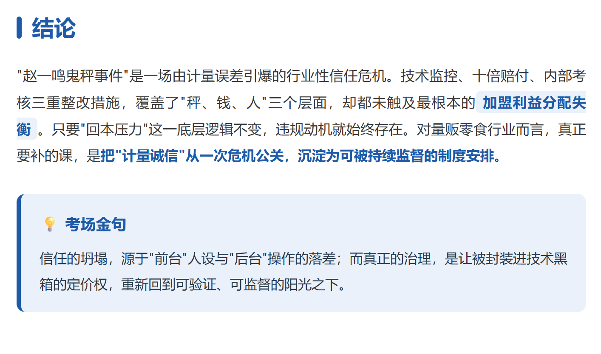
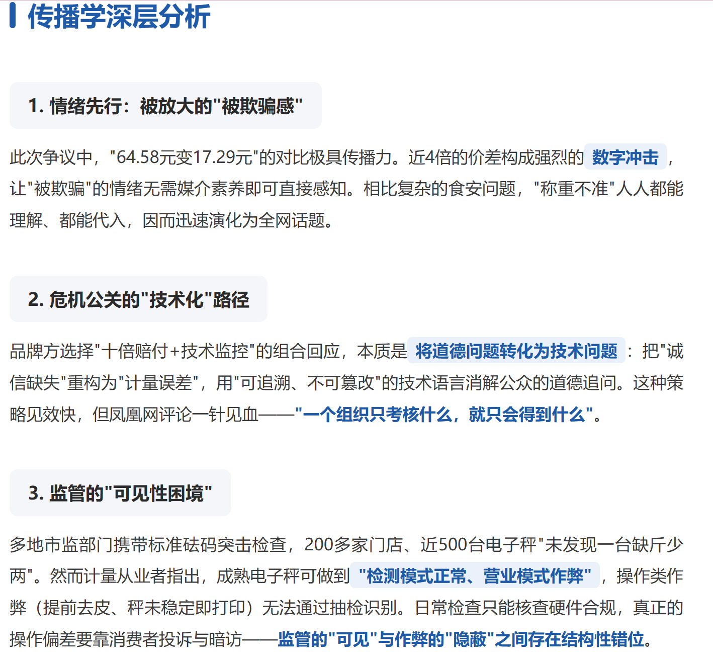
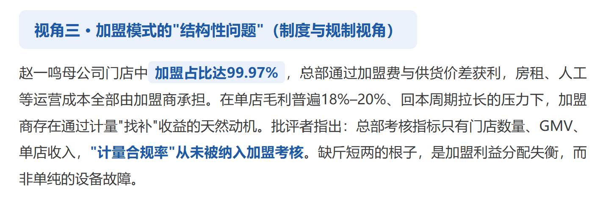
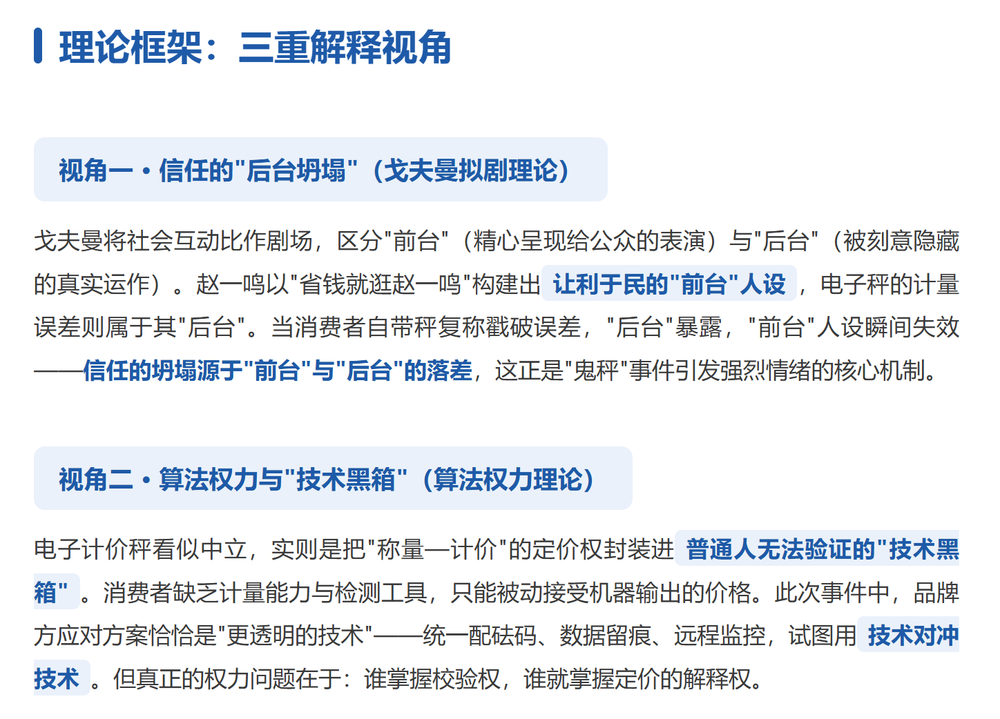
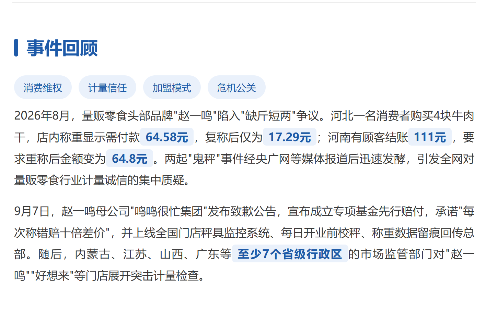

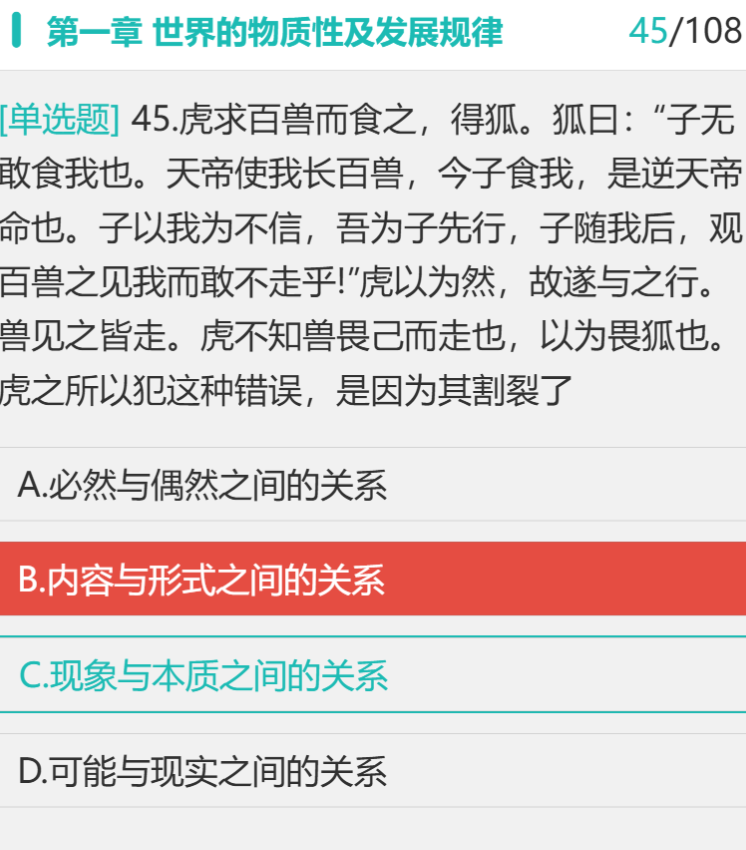
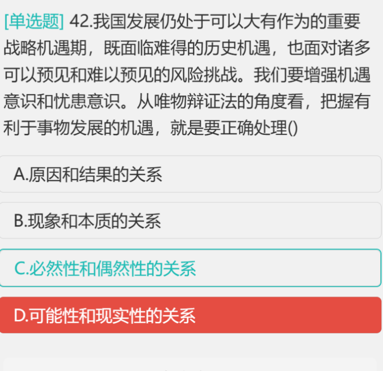
戈夫曼理论、算法权力理论。普通人无法验证的技术黑箱（想到了微信零钱转账、银行提现的手续费问题）
✎ 技黑箱 → 技术黑箱（疑漏字）

### AI · 素材提炼建议
> 你这条素材的落点很好——「技术黑箱」+ 日常生活经验（提现手续费），这是答题时最容易出彩的组合。
> 可以对接的理论：① 戈夫曼的「拟剧论」可用于解释平台如何前台展示规则、后台隐藏算法；② 算法权力/算法黑箱，用于讨论平台对用户的隐性支配；③ 福柯的「规训」视角，可用于手续费这种「看不见的规训」。
> 建议把这条素材写成 3 句话的卡片：现象（提现手续费不透明）→ 机制（算法黑箱使普通人无法验证）→ 理论（算法权力）。这样考场上可以直接调用。
> 提醒：手续费问题涉及金融监管与平台责任，写作时注意表述客观，重点放在「信息不对称」而非价值判断。
说明：AI 区块使用楷体+深蓝，你后续可直接在原文上继续用红笔（0000FF 蓝 / FF0000 红 / C65F10 棕）批注，不影响阅读层次。