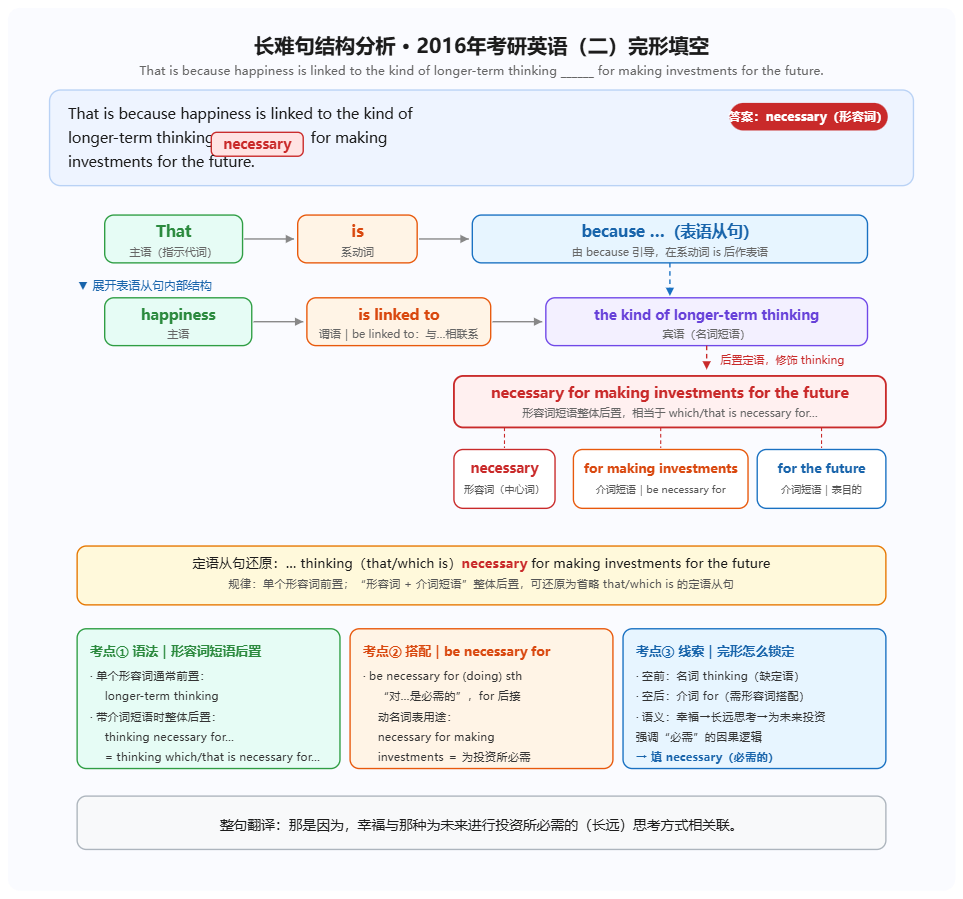

> 本文档由 `kaoyan-feedback-polish` skill 从原始 docx 优化而来。
> 标注约定：`<mark title='易错'>` = 易错点，`<mark title='次重点'>` = 次重点，`<mark title='框架'>` = 框架性内容，`**加粗**` = 原文档下划线（需背诵）。
> 以 `> ` 开头的引用块 = AI 补充内容；`✎` 行为拼写/释义订正提示。

# 每日学习反馈
Day98 · 2026.09.12 · 知栀
本文档保留你的全部原始笔记与标红/划线/高亮重点；AI 补充内容以「楷体·深蓝」单独分块，与笔记互不混淆。

## 一、政治：史纲第七章 · 为建设新中国而奋斗
<mark title='易错'>1949 年 3 月召开的中共七届二中全会，规定了党在全国胜利后在政治、经济、外交方面应当采取的基本政策，指出了中国由农业国转变为工业国、由新民主主义社会转变为社会主义社会的发展方向。</mark>
我们能够打败蒋介石，是因为蒋介石军事力量的优势和美国的援助，只是临时起作用的因素；而蒋介石发动的战争的反人民性质，人心的向背，则是经常起作用的因素，在这方面，我们点着优势。人民解放军的战争所具有的爱国的、正义的、革命的性质，必然要获得全国人民的拥护。这就是战胜蒋介石的政治基础。（有三点内容）
✎ 我们点着优势 → 我们占着优势
<mark title='易错'>1948 年 4 月 30 日，中共中央在纪念五一国际劳动节的口号中提出：「各民主党派、各人民团体、各社会贤达迅速召开政治协商会议，讨论并实现召集人民代表大会，成立民主联合政府。」这个号召得到各民主党派和社会各界的热烈响应，揭开了中国共产党同各党派、各团体、各族各界人士协商建国的序幕，奠定了中国共产党领导的多党合作和政治协商制度的基础。</mark>
《对时局的意见》这个政治声明表明，中国各民主党派和无党派民主人士公开自愿接受中国共产党的领导，决心走人民革命的道路，拥护建立人民民主的新中国。
1949 年，毛泽东在同有关人士的谈话时提出，民主党派应「积极参政，共同建设新中国」，这标志着民主党派地位的根本变化。
国民党军事失利是第二条战线形成之后带来的影响，不是形成的原因。
<mark title='易错'>1947 年 12 月，中共中央在陕北米脂县杨家沟召开会议，制定了夺取全国胜利的行动纲领。毛泽东指出，中国革命已经发展到了一个历史的转折点。这是蒋介石 20 年反革命统治由发展到消灭的转折点，这是 100 多年来帝国主义在中国的统治由发展到消灭的转折点。</mark>
**1949 年 3 月 25 日，毛泽东等中央领导人与中央机关、人民解放军总部进驻北平（北京）香山，标志着中国革命重心从农村转向城市。**
长征实现了中国共产党和中国革命事业从挫折走向胜利的伟大转折。
抗日战争的伟大胜利，是中华民族从近代以来陷入深重危机走向伟大复兴的历史转折点。
《共同纲领》不是社会主义类型的临时宪法。第一部社会主义类型的宪法是《中华人民共和国宪法》。
✎ 第一步社会主义类型的宪法 → 第一部社会主义类型的宪法
<mark title='易错'>社会主义制度的确立为当代中国的一切发展提供根本政治保障</mark>
1945 年，蒋介石连发三电的原因：1）全国人民强烈要求和平、反对内战 2）国民党军队大部分远在西南、西北后方 3）国民党完成内战部署需要一定的时间 4）国际上苏联、美国等表示希望建立和平民主的新中国。
一边倒外交政策是 1949 年提出来的，争取社会主义阵营的广泛支持。

### AI · 本节四个「转折点」的辨析（高频易混）
> 你笔记里连写了三个「转折」，这正是考试设错项的地方，建议一次性分清：
> 长征胜利（1936）：中国共产党和中国革命事业从挫折走向胜利的伟大转折。
> 抗日战争胜利（1945）：中华民族从近代以来陷入深重危机走向伟大复兴的历史转折点。
> 1947 年杨家沟会议：中国革命发展到历史转折点——蒋介石 20 年统治由发展到消灭、帝国主义在华统治由发展到消灭。
> 中共七届二中全会（1949.3）：中国革命由农村转向城市的转折（注意：香山进驻是这一转折的落实标志）。
> 记忆法：看主语。主语是「革命事业」→ 长征；主语是「中华民族」→ 抗战；主语是「蒋介石统治」→ 杨家沟；主语是「工作重心」→ 七届二中全会。

### AI · 易错点提醒
> 《共同纲领》的性质：起临时宪法作用，但不是社会主义类型的宪法。你笔记里记得对，这里再确认一次——第一部社会主义类型的宪法是 1954 年《中华人民共和国宪法》。
> 第二条战线：形成于 1947 年，是国统区学生运动等人民斗争。你标注「军事失利是影响不是原因」，判断正确——原因是国民党内战政策与国统区经济崩溃。
> 一边倒：1949 年《论人民民主专政》中提出，属于三大外交方针（另两个是另起炉灶、打扫干净屋子再请客）。你只记了一边倒，建议补全三个。

## 二、英语（二）：两篇阅读训练 + 完形
英语（二）：两篇阅读训练　完型 -4　阅读 -1

### 1. 阅读一 · 词汇
plausive 赞成的　plausing 貌似合理的　可以和 applaud 放在一起
✎ plausive / plausing → 常见词形为 plausible（貌似合理的）；plausive 极少考，建议以 plausible 为主
Yung and less experieced
✎ Yung and less experieced → young and less experienced
repute 名誉　reputable 受尊敬的、声誉好的
Hold 保持不变
Strike at 袭击
Jump at 急于接受、扑向
Present　presence
Brim 边沿、盛满
Formulate logical hypotheses
Gear 齿轮、挡位；v. 为……做好准备
Coax = persuade
<mark title='易错'>Programming languages have a quick turnover. 程序语言不断推陈出新</mark>
Boot-camp 集训、新兵营
Dean 系主任、院长
Chunk 大量、整块
string（名词）细绳；线；带子　"a string of hits" 接二连三的成功

### 2. 长难句分析（保留你的逐词标记）
以下保留你对句子成分的着色标记——同一段中不同颜色代表不同层次。
That is beacuse <mark title='次重点'>happiness</mark>** is linked to **<mark title='次重点'>the kind of longer-term thinking</mark> （which is ）
<mark title='易错'>necessary</mark> for making investments for the furture.
✎ beacuse → because
✎ furture → future

### 3. 你的记忆要点（原文保留）

记忆要点：看到「名词 + ___ + 介词短语」的完形题，优先想到形容词 / 分词短语后置作定语，再用 be + adj + for 的搭配验证，语义上表「必需 / 必要」就锁定 necessary。

### 4. 你的反思（原文保留）
<mark title='框架'>反思：长难句的句子结构有些遗忘，然后英二相比英一简单很多，思维模式需要切换过来，细节理解题不需要过于复杂的推理，直接对应原文找答案。选项大多可以排除法找出正确答案。</mark>

### AI · 关于这句长难句的结构还原
> 原句应为：That is because happiness is linked to the kind of longer-term thinking (which is) necessary for making investments for the future.
> 主干：That is because...（because 引导表语从句）。
> 从句主干：happiness is linked to the kind of longer-term thinking。
> 后置定语：(which is) necessary for... 修饰 thinking。这里的 which is 是可省略部分，这正是你要记的结构——名词 + (which is) + 形容词短语 + 介词短语。
> 你标注的颜色分层很准确：绿色标宾语核心、黄色标答案词、下划线标谓语结构。这套标记法建议固定下来，之后所有长难句都这么标。

### AI · 「思维模式切换」这一点抓得非常准，补充具体做法
> 你说「英二比英一简单很多，思维模式需要切换」——这是英一考生做英二最常见的失分原因，值得展开成可执行的动作。
> 英一 vs 英二的差异：英一细节题常需要识别同义改写与隐含态度，选项设置更绕；英二细节题基本是原文直给，答案句与选项高度字面对应。
> 切换动作：做英二时，找到定位句后优先选与原文用词重合度最高的选项，不要习惯性地去排除「太直接的选项」。你在英一训练出的「太简单就可疑」的直觉，在英二反而会害你。
> 但要注意：英二的推理题（infer / suggest）和主旨题仍然需要概括，不能用直选法。你的错 1 题可以回看是不是这类。
> 你的实际情况：英二 -1 阅读、-4 完形。完形失分多于阅读，说明词汇辨析和逻辑连词是当前短板，而不是阅读能力。重心应该放在完形与词汇上。

### AI · 下一步建议
> 完形专练：每周 2 篇，每篇做完后逐题标出考的是「词义辨析」还是「逻辑关系」。连做两周就能看出自己的高频失分类型。
> 词汇回滚：你今天这份清单里的词（plausible、repute、coax、brim、gear）建议三天后、一周后各回滚一次，只看英文说中文。
> 长难句：你已经在做逐句分析了，保持这个动作。每天 2 句、写出主干即可，不要过度分析修饰成分，英二对此要求不高。
说明：AI 区块使用楷体+深蓝，你后续可直接在原文上继续用红笔（4874CB / E54C5E / 0000FF / FF0000）批注，不影响阅读层次。